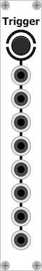

# [VCVRack-Simple](https://iohannrabeson.github.io/VCVRack-Simple/) 
Modules for [VCVRack](https://github.com/VCVRack/Rack).

## [Modules](docs/modules/modules_index.md)

## Build from sources
### Linux
Compilation is tested on Linux with gcc-7.

### Osx
Compilation is tested on Osx with clang.
