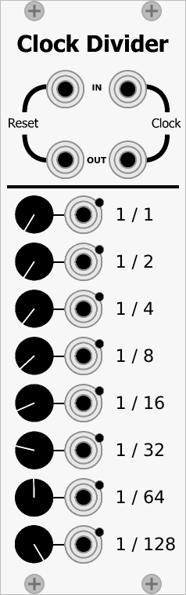
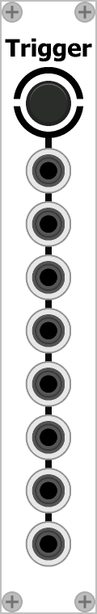
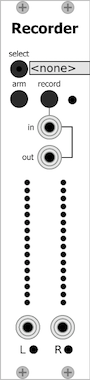

## Modules

## Documentation

[Module manuals](docs/modules/modules_index)

## Issue tracker

Use the [issue tracker](https://github.com/IohannRabeson/VCVRack-Simple/issues) to submit bug reports and feature requests.  
